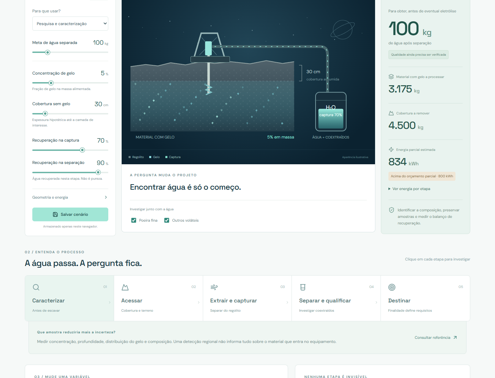

# AQUA Lunar

**A mesma molécula. Outra missão.**

Um laboratório interativo para entender como o material encontrado muda uma missão de extração de água lunar. Concentração de gelo, cobertura, recuperação e finalidade aparecem em um mesmo cenário, com balanço de massa, energia parcial e perguntas para a próxima investigação.

[Abrir laboratório](https://soubeatrizkaroline.github.io/SpaceMiningChallenge_AquaLunar/) · [Método](./docs/metodologia.md) · [Fontes](./docs/fontes.md) · [Contribuir](./CONTRIBUTING.md)

**MVP funcional v0.1.0.** [Aplicação ao desafio](./docs/desafio.md) · [Integrações e dados externos](./docs/integracoes.md) · [Validação e limites](./docs/validacao.md)




## A pergunta que orienta o projeto

Dois locais podem conter gelo e exigir operações completamente diferentes. Quanto material precisa ser processado? O que deve ser removido antes? Quanto da água é recuperado? Quais espécies vêm junto? O que muda quando o destino é pesquisa, suporte à vida ou produção de gases?

O AQUA Lunar permite explorar essas relações sem apresentar um cenário hipotético como uma jazida medida.

## O que é o AQUA Lunar

O AQUA Lunar é um laboratório de decisão para uma hipótese de mineração de água lunar. Ele organiza uma pergunta que costuma ser simplificada demais: encontrar H₂O não basta para decidir extrair. É preciso avaliar a forma em que o material aparece, o acesso, as perdas de processo, a energia, os materiais coextraídos e a finalidade do produto.

O projeto separa quatro coisas que não devem ser confundidas:

| Elemento | Como o projeto trata |
| --- | --- |
| Dados científicos | Links e caminhos para acervos primários, com instrumento, produto e versão. |
| Evidência | Uma interpretação verificável de um produto, registrada com sua origem e limite. |
| Premissa de engenharia | Valores ajustáveis para concentração, cobertura, recuperação e energia. |
| Resultado do modelo | Consequência matemática das premissas, nunca uma medição lunar. |

Essa separação mantém a discussão útil para pesquisa e para o desafio: uma hipótese pode mudar quando uma evidência melhor aparece.

## Alinhamento ao Space Mining Challenge Brasil 2026

O briefing pede que a equipe decida o que vale a pena minerar, em vez de apenas mostrar que um recurso existe. O AQUA Lunar é alinhado como ferramenta de apoio a uma decisão sobre água, desde que a equipe complete a escolha de uma região real com evidências espaciais verificáveis.

| Parte solicitada no desafio | Como o AQUA Lunar contribui | O que a equipe ainda precisa apresentar |
| --- | --- | --- |
| Decisão | Ajuda a estruturar a escolha de água como recurso e a finalidade de uso. | Uma frase com nome da missão, recurso e região específica. |
| Evidência | Reúne fontes primárias e caminhos para Moon Trek, Diviner, LOLA, LEND e ODE. | Pelo menos três evidências ligadas a instrumento ou camada, com interpretação da área escolhida. |
| Extração | Modela alimentação, cobertura, perdas, energia parcial e perguntas de caracterização. | Uma operação coerente com as condições e premissas da região. |
| Utilização | Permite comparar pesquisa, suporte à vida, oxigênio e gases para propelente. | A cadeia de valor e os requisitos do produto para a finalidade escolhida. |
| Processo de decisão e uso de IA | Exporta premissas, cálculos, fontes e limites para revisão. | Registrar como ferramentas foram usadas, o que foi conferido na fonte primária e o que foi considerado incerto ou não confiável. |

O briefing também indica Moon Trek como ponto de partida, um documento de até 14 slides e pitch de 5 minutos. O aplicativo não substitui os slides nem o pitch. Ele serve para documentar o raciocínio antes deles.

### Estado atual de alinhamento

O núcleo do projeto está alinhado ao desafio ao explicitar escolhas, perdas, incertezas e critérios de uso. Ele ainda não produz uma decisão final de missão, porque não associa automaticamente os controles a uma região lunar validada. Essa etapa deve ser feita pela equipe com produtos espaciais da área escolhida e registrada nas evidências.

## O que funciona

| Experiência | O que permite fazer |
| --- | --- |
| Corte conceitual interativo | Visualizar mudanças na cobertura, presença de gelo e captura. |
| Três perfis de material | Explorar gelo disperso, depósito enterrado e mistura complexa. |
| Premissas ajustáveis | Alterar concentração, cobertura, recuperação, meta, área e energia. |
| Finalidades diferentes | Investigar pesquisa, água para suporte à vida, oxigênio ou hidrogênio e oxigênio. |
| Balanço de massa | Acompanhar água contida, não capturada, perdida na separação e recuperada. |
| Energia parcial | Comparar com um orçamento e abrir o consumo estimado de cada etapa. |
| Sensibilidade | Mudar a concentração e observar a alimentação necessária para a mesma meta. |
| Etapas de processo | Investigar caracterização, acesso, captura, separação e destinação. |
| Comparação | Comparar o cenário atual, três perfis e um cenário salvo. |
| Persistência local | Salvar e recuperar um cenário no mesmo navegador. |
| Exportação | Baixar um relatório Markdown com entradas, cálculos, limites e fontes. |
| Evidências | Consultar fontes primárias e caminhos de pesquisa para dados lunares. |
| Consulta ao ODE | Módulos para consultar metadados públicos do acervo lunar da NASA PDS e preservar a procedência da consulta. |
| Cenários portáteis | Funções validadas para exportar e importar premissas em JSON versionado. |

**Todos os parâmetros numéricos de entrada são hipóteses.** Não foram extraídos automaticamente de rasters lunares nem calibrados com equipamentos. A interface é um laboratório de cenários, sem certificação de potabilidade, previsão operacional ou reserva mineral estimada.

## Como utilizar para construir a missão

1. Abra **Laboratório** e escolha a finalidade. Ajuste somente premissas que a equipe consegue explicar. Salve e exporte o cenário quando quiser comparar uma versão.
2. Em **Dados lunares**, consulte uma camada no catálogo ODE. Abra o produto original, leia o rótulo e guarde apenas os registros que ajudam a responder uma pergunta da missão. O catálogo lista metadados, não mede gelo automaticamente.
3. Em **Missão**, dê um nome à missão e informe a região. Registre ao menos três evidências, cada uma com instrumento ou camada, produto, interpretação, limite e link primário.
4. Descreva a operação de acesso, captura e separação. O painel incorpora as premissas atuais do laboratório, mas elas continuam sendo hipóteses até serem sustentadas por dados e ensaios.
5. Explique a utilização do produto e preencha o registro de verificação: fontes abertas, ferramentas usadas, hipóteses mantidas e informações descartadas.
6. Exporte o rascunho de missão em Markdown. Use-o como base para organizar os slides, revisando cada afirmação contra a fonte original.

### Antes de entregar

- A decisão tem recurso, região e finalidade em uma frase.
- Há pelo menos três evidências complementares, com limites explícitos.
- A extração corresponde ao terreno e ao material descritos.
- A utilização não trata água separada como água certificada para consumo ou propelente pronto.
- O processo de decisão identifica as fontes verificadas e o uso de ferramentas.
- O documento final respeita o limite de 14 slides e o pitch de 5 minutos indicado no briefing.

## Experimente em três minutos

1. Mantenha a meta em **100 kg** e selecione **gelo disperso**.
2. Observe a massa com gelo que precisa entrar no processo.
3. Selecione **depósito enterrado** e compare a alimentação com a cobertura a remover.
4. Reduza a recuperação na separação e observe o balanço de água.
5. Troque a finalidade para produção de gases. A energia de eletrólise entra no modelo e a água é convertida em equivalentes ideais de H₂ e O₂.
6. Abra a comparação e exporte o raciocínio.

Para um fluxo completo de entrega, comece pelos dados, avance para a missão e só então transforme o resultado em apresentação.

## Executar localmente

Requisitos: Node.js 22.12 ou superior e npm.

```bash
git clone https://github.com/SouBeatrizKaroline/SpaceMiningChallenge_AquaLunar.git
cd SpaceMiningChallenge_AquaLunar
npm ci
npm run dev
```

| Comando | Finalidade |
| --- | --- |
| `npm run dev` | Desenvolvimento local. |
| `npm run check` | Verificação TypeScript e testes do modelo. |
| `npm test` | Testes do balanço e das regras. |
| `npm run build` | Distribuição estática em `dist/`. |
| `npm run preview` | Prévia local da distribuição. |

Não exige cadastro, backend ou chave de API. As fontes tipográficas são servidas com a aplicação. O cenário salvo usa o armazenamento local do navegador; limpar os dados do site também remove esse cenário.

## Como interpretar os números

Para uma meta de água **antes de eventual eletrólise**:

```text
material com gelo = meta / (fração de gelo × recuperação na captura × recuperação na separação)
cobertura a remover = área × espessura sem gelo × densidade assumida
```

Um exemplo com 100 kg, 5% de gelo, captura de 70% e recuperação na separação de 90% resulta em aproximadamente **3.175 kg de material alimentado**. Isso é uma consequência das premissas, não uma medição lunar.

A recuperação na separação mede a fração de água que atravessa a etapa. **Não mede pureza nem remoção de contaminantes.** As opções de poeira e voláteis geram perguntas de caracterização, sem atribuir um tratamento ou consumo energético que ainda não conhecemos.

Nos objetivos com eletrólise, o modelo converte toda a meta em equivalentes químicos aproximados: 8/9 de oxigênio e 1/9 de hidrogênio em massa. Não soma esses gases à água como produtos simultâneos. A conversão real, a pureza e o armazenamento precisam de avaliação adicional.

Consulte [equações, coeficientes e limites](./docs/metodologia.md).

## Fontes utilizadas

As referências abaixo orientam o contexto e as perguntas. **Nenhuma delas fornece automaticamente os coeficientes ilustrativos do simulador.**

| Fonte | Papel no projeto |
| --- | --- |
| [NASA Science: Moon Water and Ices](https://science.nasa.gov/moon/moon-water-and-ices/) | Contexto sobre formas e evidências de água lunar. |
| [NASA: How Will We Extract Water on the Moon?](https://www.nasa.gov/general/how-will-we-extract-water-on-the-moon-we-asked-a-nasa-technologist-episode-47/) | Introdução à extração e recuperação de água. |
| [NASA Science: LCROSS](https://science.nasa.gov/mission/lcross/) | Evidência regional em Cabeus, sem extrapolação para uma jazida inteira. |
| [NASA: What is LCROSS?](https://www.nasa.gov/general/what-is-lcross-the-lunar-crater-observation-and-sensing-satellite/) | Contexto dos materiais identificados pela missão e da necessidade de caracterização. |
| [NASA NTRS: Technology Assessment for Producing Propellant From Lunar Water](https://ntrs.nasa.gov/citations/20230010039) | Referência de cadeia com extração, captura, purificação e eletrólise. |
| [NASA NIAC: Aqua Factorem](https://www.nasa.gov/general/aqua-factorem-ultra-low-energy-lunar-water-extraction/) | Conceito de separação de gelo e regolito para discussão de rotas alternativas. |
| [NASA/JPL: Moon Trek](https://trek.nasa.gov/moon/) | Ponto de partida para uma futura seleção de área com camadas verificáveis. |
| [NASA PDS: Diviner](https://pds-geosciences.wustl.edu/missions/lro/diviner.htm) | Dados térmicos e produtos derivados. O briefing do desafio pede PRP V2.0. |
| [NASA PDS: LOLA](https://pds-geosciences.wustl.edu/missions/lro/lola.htm) | Altimetria e topografia para investigar acesso. |
| [NASA PDS: LEND](https://pds-geosciences.wustl.edu/missions/lro/lend.htm) | Contexto para leitura de produtos de nêutrons e investigação de hidrogênio. |
| [Lunar Orbital Data Explorer](https://ode.rsl.wustl.edu/moon/) | Busca e acesso a produtos e metadados. |
| [ODE REST Interface Manual](https://oderest.rsl.wustl.edu/ODE_REST_V2.1.6.pdf) | Referência da consulta pública de metadados usada pelos módulos de integração. |
| [Diviner PRP, rótulo do polo sul](https://pds-geosciences.wustl.edu/lro/urn-nasa-pds-lro_diviner_derived1/data_derived_prp/dlre_prp_south.xml) | Verificação de campos de versão e do significado dos produtos polares derivados. |

O corte do material é uma ilustração vetorial construída para esta interface, sem escala ou localização real. Não é imagem orbital, mapa de gelo ou desenho de equipamento validado.

## Estrutura

```text
src/
  App.tsx          Interface, diagrama e navegação
  model.ts         Catálogo, balanços, perguntas e relatório
  lunarApi.ts      Consulta e validação de metadados do ODE
  scenarioFiles.ts Importação e exportação de cenários em JSON
  styles.css       Identidade visual e responsividade
tests/
  model.test.ts    Conservação de massa, limites e comportamento
docs/
  metodologia.md  Equações e fronteiras do modelo
  fontes.md       Proveniência e interpretação
  arquitetura.md  Estrutura e evolução
  desafio.md      Uso no Space Mining Challenge
  integracoes.md  ODE, procedência, privacidade e limites
  validacao.md    Testes realizados e limites da verificação
```

## Qualidade e privacidade

O modelo possui testes automatizados para o balanço de massa, limites de cenários, serialização de arquivos e normalização de respostas do catálogo. Os fluxos principais da interface atual foram exercitados em Chromium, incluindo exportação, recuperação do cenário salvo, comparação e navegação em telas de 390 e 320 pixels. Consulte o [registro de validação](./docs/validacao.md).

O botão de salvar mantém um único cenário local e substitui o anterior. Alterações posteriores só são persistidas ao salvar novamente. Restaurar as premissas iniciais mantém o cenário salvo disponível na comparação.

Não há cadastro, telemetria ou envio de cenários a um servidor. A exportação é produzida no próprio navegador. Links externos abrem as instituições responsáveis pelas referências.

## Publicar uma cópia

1. Faça um fork e ative o GitHub Actions.
2. Em **Settings → Pages**, selecione **GitHub Actions** como origem.
3. Execute o workflow **Publicar demonstração** ou envie uma alteração para `main`.
4. Atualize os links deste README e de `src/App.tsx` para sua conta.

O workflow valida e compila antes da publicação. Uma falha nos testes impede a atualização do site.

## Dúvidas frequentes

**Os valores vêm diretamente da NASA?** As fontes orientam o contexto científico. Os números ajustáveis são hipóteses didáticas, sem integração automática com os acervos.

**O resultado permite escolher onde minerar?** Ele ajuda a comparar premissas de processamento. Escolher uma região exige evidências espaciais, condições operacionais e caracterização do material.

**90% de recuperação significa água 90% pura?** Não. Significa que 90% da massa de água que entra nessa etapa é recuperada. O modelo não calcula pureza.

**Por que há hidrogênio quando escolho produzir oxigênio?** A eletrólise produz ambos. O modelo apresenta os dois equivalentes químicos para manter o balanço de massa.

## Próximas etapas

- Selecionar uma área real e registrar pelo menos três evidências espaciais.
- Substituir premissas por medições, com unidade, resolução, versão e incerteza.
- Incorporar propriedades térmicas e requisitos de equipamentos.
- Estimar tratamentos somente após caracterizar os materiais coextraídos.
- Incluir compressão, armazenamento e demais subsistemas no balanço energético.
- Confrontar o modelo com ensaios e revisão técnica independente.

## Publicação e licença

GitHub Actions verifica a aplicação e publica a demonstração no GitHub Pages. O código usa a [licença MIT](./LICENSE). DM Sans e Space Grotesk mantêm suas [licenças SIL OFL](./public/font-licenses.txt).

Projeto independente, sem endosso das instituições citadas. O AQUA Lunar é um repositório separado da [SENTINELA Lunar](https://github.com/SouBeatrizKaroline/sentinela-lunar), com foco no material, no processamento e no uso da água.
