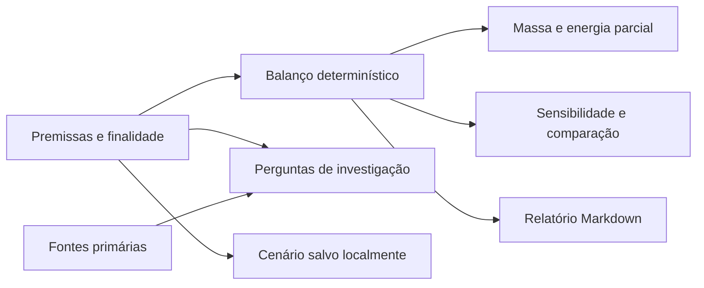

# Arquitetura

Aplicação estática em React, TypeScript e Vite. Cálculos, comparação, exportação e persistência são executados no navegador.

`src/model.ts` valida entradas, define fontes e perfis, calcula o balanço e gera o relatório. `src/App.tsx` organiza a experiência e constrói o corte conceitual com SVG. `src/styles.css` mantém a identidade visual, as telas móveis e a preferência por movimento reduzido.

O armazenamento usa a chave versionada `aqua-lunar.scenario.v1`. Dados recuperados são validados antes de entrar no modelo. Falha no armazenamento não impede a exportação.

Os relatórios são gerados localmente. Não há cadastro, chamada a modelo generativo, telemetria ou transmissão de cenários a um servidor. Links de referência levam aos sites de terceiros quando abertos.

## Distribuição

O build usa caminhos relativos para permitir hospedagem em um subdiretório do GitHub Pages. Os workflows de qualidade e publicação executam os testes antes de distribuir o aplicativo. Nenhuma credencial é necessária no código do cliente.

## Evolução

Uma futura camada de observações deve preservar unidades, versões e incertezas separadamente das premissas de equipamento. A introdução de dados reais não valida automaticamente os coeficientes do modelo.
