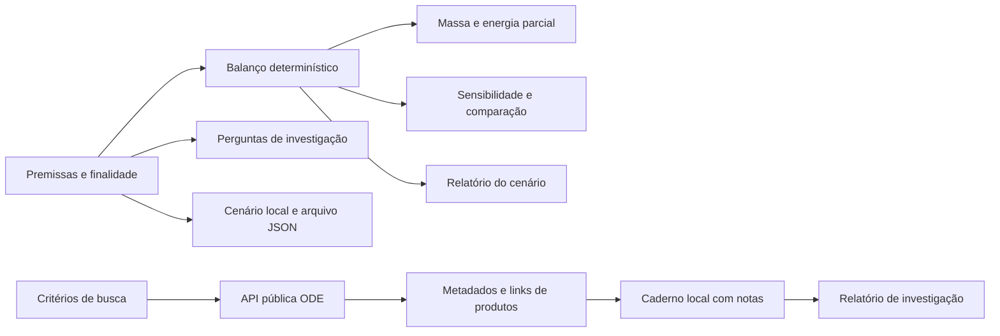

# Arquitetura

Aplicação estática em React, TypeScript e Vite. O navegador executa os cálculos, a comparação, a importação e exportação de cenários e o caderno de investigação. A consulta ao catálogo ODE usa uma API pública externa.

## Fronteiras do sistema

O modelo e o catálogo têm funções diferentes. O modelo explora consequências das premissas; o catálogo localiza produtos que podem ajudar a investigá-las. Um resultado do ODE não modifica concentração de gelo, recuperação, profundidade ou energia no simulador.

`src/model.ts` valida entradas do modelo, define fontes e perfis, calcula o balanço e gera o relatório do cenário. `src/scenarioFiles.ts` trata a troca de cenários por arquivo. `src/lunarApi.ts` constrói consultas, normaliza respostas do ODE, controla o cache da sessão e prepara os registros do caderno. `src/App.tsx` organiza a experiência e constrói o corte conceitual com SVG. `src/styles.css` mantém a identidade visual, as telas móveis e a preferência por movimento reduzido.

## Persistência e arquivos

O cenário salvo usa a chave versionada `aqua-lunar.scenario.v1`. Dados recuperados são validados antes de entrar no modelo. Falhas no armazenamento não impedem o uso dos controles ou a exportação do cenário atual.

A troca de cenários usa JSON com `schemaVersion: 1` e limite de 64 KiB. A importação verifica a estrutura e os valores antes de aplicar o cenário. O arquivo é lido no navegador, sem upload. Os relatórios Markdown também são gerados localmente.

O caderno de investigação guarda até 12 registros escolhidos no catálogo, com notas de até 1.200 caracteres, no armazenamento local. Limpar os dados do site remove o cenário salvo e o caderno. Esses registros não são sincronizados entre dispositivos.

## Integração externa

As consultas são feitas diretamente do navegador para o ODE, sem backend próprio e sem chave de API. O serviço recebe os critérios da consulta e os dados de conexão usuais, como o endereço IP. O aplicativo não inclui o cenário nem as notas do caderno nas consultas.

O catálogo trata carregamento, ausência de resultados e erros de consulta. A disponibilidade da pesquisa depende do serviço externo, da conexão e da permissão de acesso entre origens do servidor. Uma falha de consulta não impede os cálculos locais.

Cada consulta pede até seis produtos, com paginação por deslocamento. Um cache em memória por cinco minutos evita repetir consultas idênticas; ele termina ao recarregar a página. O cliente usa um limite de 20 segundos por requisição. O estado de sucesso no corpo da resposta também é verificado, pois uma resposta HTTP 200 pode conter um erro do serviço.

Metadados externos são apresentados como texto e links de referência. A aplicação não executa código fornecido pelo catálogo, não baixa automaticamente rasters científicos e não interpreta valores de pixels. Consulte [contrato e limites da integração](./integracoes.md).

## Distribuição

O build usa caminhos relativos para permitir hospedagem em um subdiretório do GitHub Pages. Os workflows de qualidade e publicação executam os testes antes de distribuir o aplicativo. Nenhuma credencial precisa ser inserida no código do cliente.

Não há cadastro ou telemetria própria. A hospedagem e os sites externos mantêm suas próprias políticas e registros de acesso. As consultas ao ODE são a exceção explícita ao processamento inteiramente local.

## Evolução

Uma futura leitura de dados científicos precisa preservar unidade, versão, projeção, resolução, método de extração e incerteza. Mesmo com essa leitura, as premissas de equipamento continuam exigindo validação independente. Consultar um catálogo de produtos não equivale a integrar medições ao modelo de extração.
