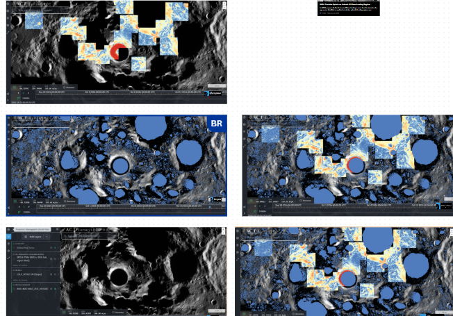

# Como interpretar as capturas do QuickMap

Esta montagem reúne consultas feitas no LROC QuickMap. Ela é um registro do processo de análise da equipe. Não é um mapa de reserva de água.

## O que aparece na montagem

| Posição | Camada ou registro | O que mostra | Para que serve | O que não demonstra |
|---|---|---|---|---|
| Superior esquerdo | Base LROC com trechos coloridos de LOLA Slope | Relevo em tons de cinza e valores de declividade onde o produto possui cobertura. | Identificar encostas e restringir rotas de rover, cabos ou equipamentos. | Água, hidrogênio, gelo ou local final de mineração. |
| Meio esquerdo | PSRs sobre a base do terreno | Formas preenchidas em azul correspondem a regiões permanentemente sombreadas. | Localizar zonas com condição favorável à preservação de voláteis. | Presença, quantidade, pureza ou acessibilidade de gelo. |
| Meio direito | PSRs, relevo e declividade combinados | Relação visual entre sombra permanente e características do terreno. | Priorizar áreas para análise conjunta de iluminação, rota e prospecção. | Viabilidade de operação sem medição de rota, rochas e energia. |
| Inferior esquerdo | Painel de camadas | Identifica Global Max Temp, SPOLE PSRs, LOLA_SPOLE 5M [Slope] e a base LROC. | Comprovar quais dados foram consultados e reproduzir a configuração. | Um valor de temperatura, teor de água ou sinal de hidrogênio, pois não há legenda nem leitura numérica do cursor. |
| Inferior direito | Nova combinação das camadas | Sobreposição de dados de sombra, terreno e declividade. | Apoiar a comparação visual antes de delimitar rota e ponto de implantação. | Uma decisão final de pouso ou lavra. |

## Como ler as cores

- **Cinza:** imagem de base LROC, útil para observar morfologia e crateras.
- **Azul preenchido:** camada de PSRs, regiões com sombra permanente.
- **Azul, branco, laranja e vermelho em mosaicos:** valores da camada LOLA Slope onde há cobertura. A escala exata deve ser lida na legenda da camada; sem legenda, não se atribui um número de graus às cores.
- **Preto, transparente ou sem cor em uma camada:** ausência de dado válido naquele pixel. Isso não significa terreno plano nem ausência de água.
- **Anel laranja ou vermelho próximo de uma cratera:** variação visual da camada de declividade. Não é marcador de água nem uma confirmação de área de mineração.

## O que as capturas viabilizam

As imagens permitem defender que a equipe consultou dados de terreno, sombra e condição térmica antes de escolher a região. Elas ajudam a planejar a próxima etapa: combinar uma área de iluminação, uma rota de mobilidade e uma zona de prospecção dentro do entorno de Shackleton.

## O que ainda exige outro dado

As imagens não possuem uma camada LEND identificada. Portanto, não são evidência visual de hidrogênio. Para isso, use o produto LEND e declare que o sinal de nêutrons é indireto. Elas também não vinculam, sozinhas, o centro da tela à coordenada de Shackleton. Uma captura definitiva deve mostrar ponto ou pesquisa em aproximadamente **89,6° S, 129,2° E**, escala, nome da camada e legenda.

## Frase segura para a apresentação

> As camadas consultadas mostram relevo, declividade, sombra permanente e condição térmica de referência. Elas apoiam a seleção de áreas para prospecção e planejamento de rota, mas não comprovam, sozinhas, água extraível ou uma mina viável.

## Registro LEND criado para Shackleton

A equipe agora possui uma [consulta reproduzível do QuickMap com LEND](<https://quickmap.lroc.im-ldi.com/layers?prjExtent=-63200.3965068%2C-67666.1295457%2C81999.6034932%2C52333.8704543&selectedFeature=%40%40user-defined%2CK7JmI&earthShadowEnabled=true&proj=27&stack=3314%2C3035&defs=N4IgzADGCsIFygPYAcCGBjAlgFwJ7wEYBfAGnDAIBZ4k0s9Ciig&features=129.2%2C-89.6%40%40%7B%22id%22%3A%22K7JmI%22%7D>). Ela contém:

- projeção **Stereographic (South Pole)**;
- ponto de referência em **89,60000° S, 129,20000° E**;
- escala de **20 km**;
- camada **LRO LEND: Polar Water Equivalent Hydrogen** ativa;
- mosaico LROC como base visual.

A descrição da própria camada informa que ela é um mapa de **abundância de hidrogênio equivalente em água**, em percentagem de massa, para o polo sul entre 75° S e 90° S, derivado dos sensores colimados do LEND. A legenda da camada indica que os valores mais altos, de até **0,5 wt% WEH**, são codificados em violeta.

Este registro comprova que a equipe consultou o produto LEND na referência de Shackleton. Ele **não autoriza atribuir 0,5 wt% ao ponto marcado**, pois isso exigiria registrar o valor da legenda ou do pixel naquele ponto e considerar a resolução e o método de conversão. WEH é um indicador de hidrogênio, não confirmação direta de água extraível.